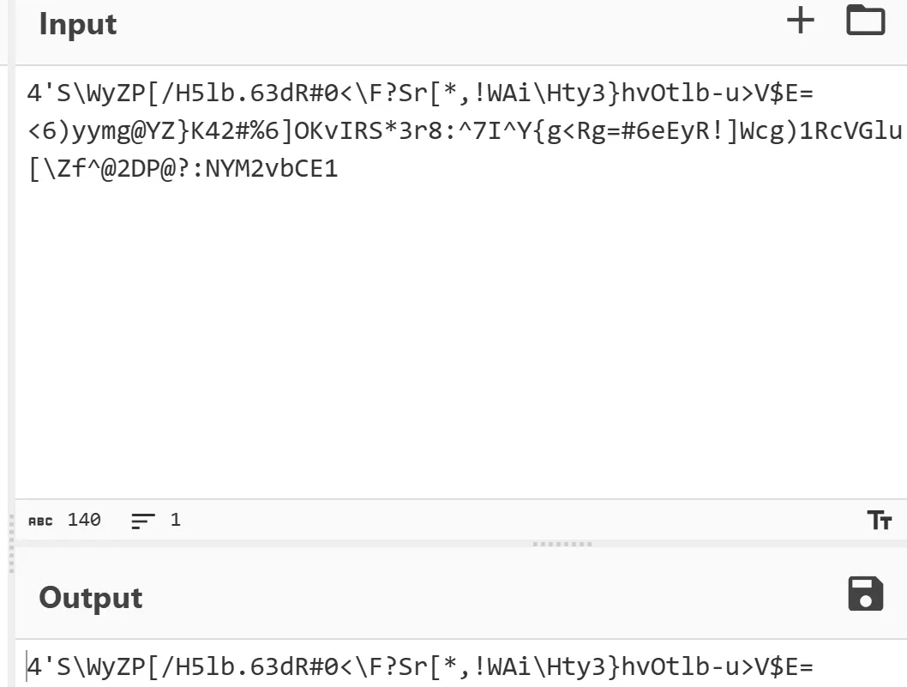
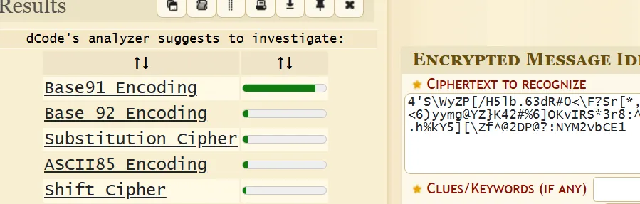
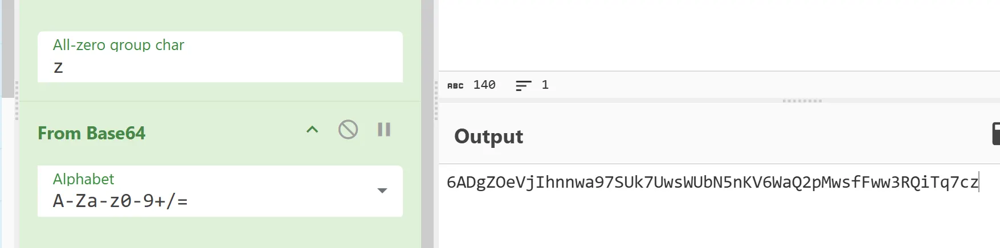
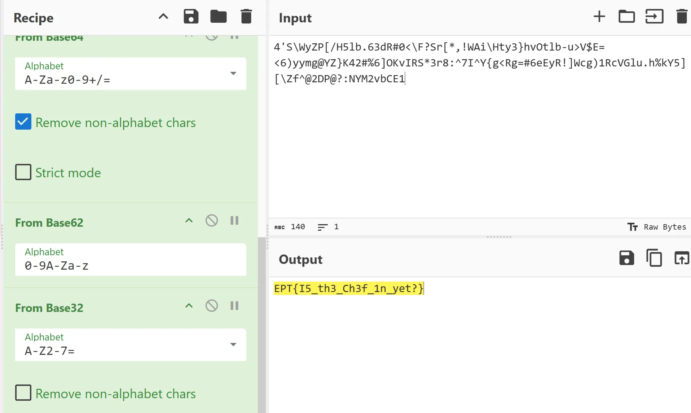

# Writeup: 420Basedit
## Team: big🔥
**Author:** SpaceyLad (Stian Kvålshagen)

### Tools

https://gchq.github.io/CyberChef/

https://www.dcode.fr/cipher-identifier

For this task I first went down the rabbit hole of looking for a way to encode or decode a base420 encoded message directly. But that does not exist..

So! I was a bit unsure how to start since cyberchef gave me nothing on its magic tool when I added the message inside of it, so I analyzed it with dcode

So I analyzed the text with dcode, which said with a high probability that it is base91 encoded.

I added it in Cyberchef and got a trail! I followed every single magic suggestion until I reached a new wall after a base64 decode.

After that I used dcode to find the new base, which was base62

Which lead to a final base32.. Which then gave the flag 🤩
And of course.. 92 + 85 + 85 + 64 + 62 + 32 = 420 x)